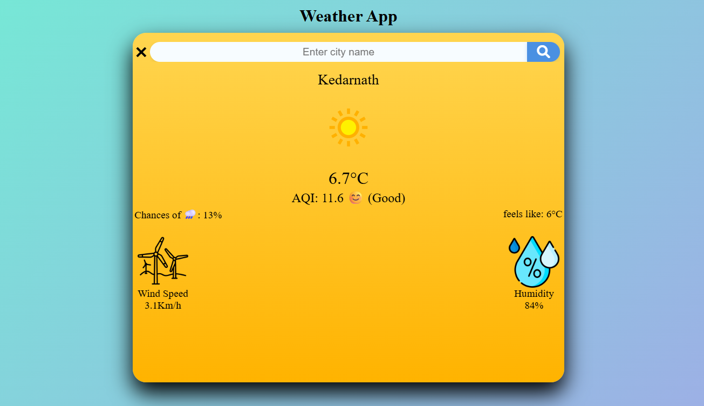

# Weather App 🌤️

A responsive weather application that provides real-time weather information for any city using the WeatherAPI.

## Features

- Search weather by city name
- Real-time temperature display
- Air Quality Index (AQI) information
- Wind speed and humidity details
- Dynamic weather-themed backgrounds
- Responsive design for mobile, tablet, and desktop
- Weather condition icons
- Keyboard support (Press Enter to search)

## Technologies Used

- HTML5
- CSS3
- JavaScript (ES6)
- WeatherAPI
- Font Awesome

## Screenshots

## Screenshot

## Screenshot



## Installation

1. Clone the repository:

```bash
git clone <https://github.com/hkkohlio7-Code/Weather-App.git>
```

2. Open the project folder.

3. Run `index.html` in your browser.

## API Used

Weather data is provided by WeatherAPI.

## Learning Outcomes

This project helped me practice:

- DOM Manipulation
- Fetch API
- Async/Await
- Event Handling
- Responsive Web Design
- CSS Media Queries
- Dynamic UI Updates
- API Integration

## Future Improvements

- Weather forecast support
- Search history
- Local storage integration
- Loading animation
- Better error handling

## Live Demo

https://hkkohlio7-code.github.io/Weather-App/

## Author

Hemant Kumar